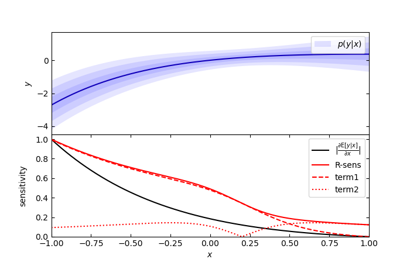

# Uncertainty-aware Sensitivity Analysis Using Rényi Divergences

This is a repository for the paper *Uncertainty-aware Sensitivity Analysis Using Rényi Divergences* by Topi Paananen, Michael Riis Andersen, and Aki Vehtari.

## Demo

The folder `demo-1D` contains a 1D demo for plotting the R-sens uncertainty-aware sensitivity for user-defined predictive distributions. The folder contains demos for a Gaussian predictive distribution and Bernoulli predictive distribution.

## GPyTorch implementation

The folder `gpytorch` contains the R-sens and R-sens2 codes for GPyTorch. There are also several scripts that show examples of how to use the code. Currently supported likelihoods are Gaussian and Bernoulli. More to come soon.

## References

Paananen, T., Andersen, M. R., and Vehtari, A. (2021). *Uncertainty-aware Sensitivity Analysis Using Rényi Divergences*. UAI 2021, accepted for publication. ([arXiv Preprint](https://arxiv.org/abs/1910.07942))
